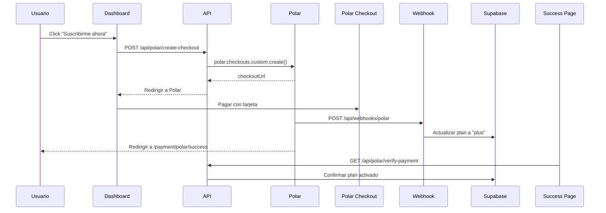

# 🌐 Guía de Configuración de Polar.sh

Esta guía te ayudará a configurar Polar.sh para aceptar pagos internacionales en Zecu.

---

## 📋 **Requisitos Previos**

- Cuenta en [Polar.sh](https://polar.sh)
- Acceso al dashboard de Polar
- Variables de entorno configuradas

---

## 🚀 **Paso 1: Crear Cuenta en Polar.sh**

1. Ve a https://polar.sh
2. Click en **"Continue with GitHub"** o **"Continue with Google"**
3. Completa el registro

---

## 📦 **Paso 2: Crear Producto "Zecu Plus"**

1. En el dashboard de Polar, ve a **"Products"**
2. Click en **"Create Product"**
3. Configura:
   - **Name:** `Zecu Plus`
   - **Description:** `20 consultas al mes con análisis avanzado de IA`
   - **Type:** `Subscription`
   - **Price:** `$10 USD`
   - **Interval:** `Monthly`
4. Click en **"Create"**
5. **IMPORTANTE:** Copia el **Price ID** (comienza con `price_...`)

---

## 🔑 **Paso 3: Obtener Access Token**

1. Ve a **"Settings"** → **"API"**
2. Click en **"Create Access Token"**
3. Configura:
   - **Name:** `Zecu Backend`
   - **Scopes:** Selecciona `products:read`, `checkouts:write`, `webhooks:read`
4. Click en **"Create"**
5. **COPIA Y GUARDA** el token (comienza con `polar_at_...`)
   - ⚠️ **Solo se muestra una vez**

---

## 🪝 **Paso 4: Configurar Webhook**

1. Ve a **"Settings"** → **"Webhooks"**
2. Click en **"Create Webhook"**
3. Configura:
   - **URL:** `https://tu-dominio.com/api/webhooks/polar`
   - **Events:** Selecciona:
     - `checkout.session.completed`
     - `subscription.created`
     - `subscription.updated`
     - `subscription.cancelled`
4. Click en **"Create"**
5. **COPIA** el **Webhook Secret** (comienza con `whsec_...`)

---

## ⚙️ **Paso 5: Configurar Variables de Entorno**

Agrega estas variables a tu archivo `.env.local`:

```bash
# Polar.sh (Pagos Internacionales)
POLAR_ACCESS_TOKEN=polar_at_xxxxxxxxxxxxx
POLAR_PRICE_ID_PLUS=price_xxxxxxxxxxxxx
POLAR_WEBHOOK_SECRET=whsec_xxxxxxxxxxxxx
```

**Reemplaza:**
- `polar_at_xxxxxxxxxxxxx` → Tu Access Token del Paso 3
- `price_xxxxxxxxxxxxx` → Tu Price ID del Paso 2
- `whsec_xxxxxxxxxxxxx` → Tu Webhook Secret del Paso 4

---

## 🧪 **Paso 6: Probar en Modo Test**

Polar.sh tiene un **modo sandbox automático** cuando `NODE_ENV=development`.

### **Tarjeta de Prueba:**
```
Número: 4242 4242 4242 4242
Vencimiento: Cualquier fecha futura (ej: 12/25)
CVV: Cualquier 3 dígitos (ej: 123)
Código Postal: Cualquier 5 dígitos (ej: 12345)
```

### **Flujo de Prueba:**
1. Inicia el servidor: `pnpm dev`
2. Ve a http://localhost:3002
3. Login con tu usuario
4. Click en **"Suscribirme ahora"**
5. Completa el checkout con la tarjeta de prueba
6. Verifica que redirige a `/payment/polar/success`
7. Confirma que tu plan cambió a **"Plus"** en el dashboard

---

## 🔄 **Cómo Funciona el Flujo**



---

## ✅ **Verificación**

Para confirmar que todo funciona:

```bash
# 1. Verifica que las variables estén cargadas
pnpm dev
# Deberías ver en consola: "✅ Polar.sh configurado correctamente"

# 2. Prueba crear un checkout
curl -X POST http://localhost:3002/api/polar/create-checkout \
  -H "Content-Type: application/json" \
  -d '{"plan":"plus"}' \
  -b "session_token=tu_token"

# 3. Verifica el webhook (usa ngrok en desarrollo)
ngrok http 3002
# Actualiza la URL del webhook en Polar con la URL de ngrok
```

---

## 🐛 **Problemas Comunes**

### **Error: "POLAR_ACCESS_TOKEN no está configurado"**
- ✅ Verifica que el `.env.local` tenga la variable correcta
- ✅ Reinicia el servidor después de agregar variables

### **Error: "Price ID no configurado para este plan"**
- ✅ Confirma que `POLAR_PRICE_ID_PLUS` esté en `.env.local`
- ✅ Verifica que el Price ID sea correcto (comienza con `price_`)

### **Error: "Webhook signature verification failed"**
- ✅ Asegúrate de usar el **Webhook Secret** correcto
- ✅ No uses el Access Token como Webhook Secret

### **El pago se procesa pero el plan no se actualiza**
- ✅ Verifica que el webhook esté configurado en Polar
- ✅ Revisa los logs del servidor para ver si el webhook está llegando
- ✅ En desarrollo, usa ngrok para recibir webhooks

---

## 📚 **Recursos**

- [Documentación Oficial de Polar.sh](https://docs.polar.sh)
- [Polar.sh SDK (npm)](https://www.npmjs.com/package/@polar-sh/sdk)
- [Guía de Webhooks](https://docs.polar.sh/docs/webhooks)

---

## 🚀 **Producción**

Para producción:

1. **Cambia `NODE_ENV=production`** en tu `.env`
2. **Usa tokens de producción** (no sandbox)
3. **Actualiza la URL del webhook** a tu dominio real
4. **Prueba con una tarjeta real** (pequeña cantidad)

---

**¡Listo!** 🎉 Polar.sh está configurado y listo para aceptar pagos internacionales.

