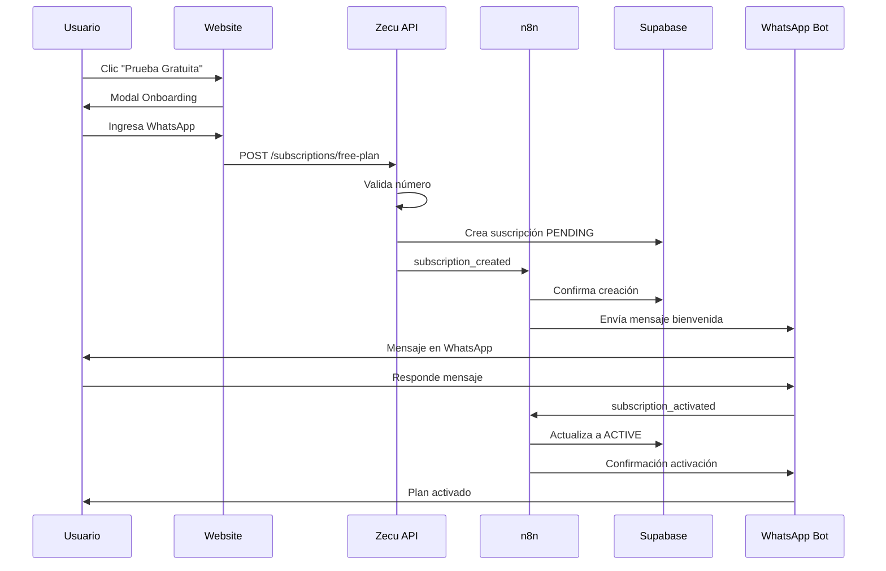
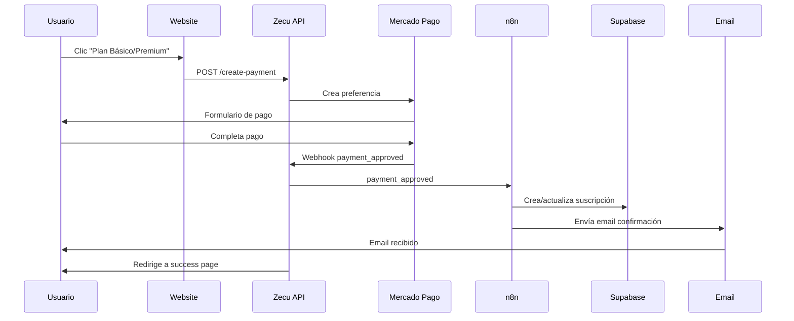
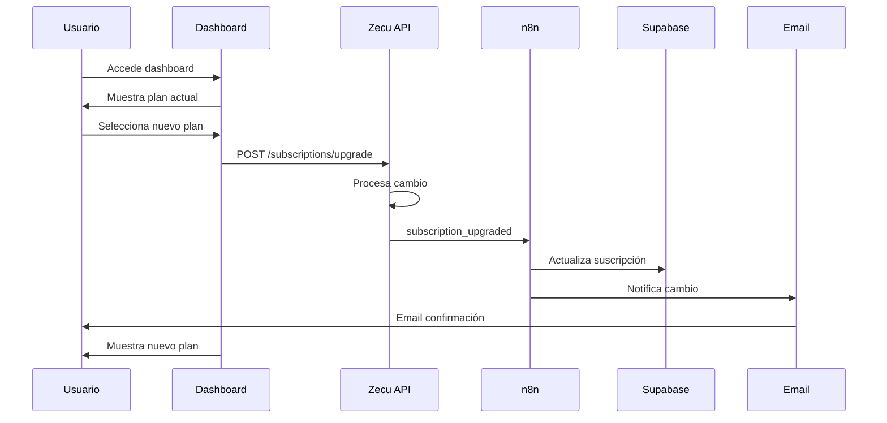
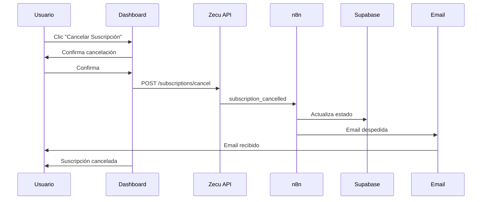
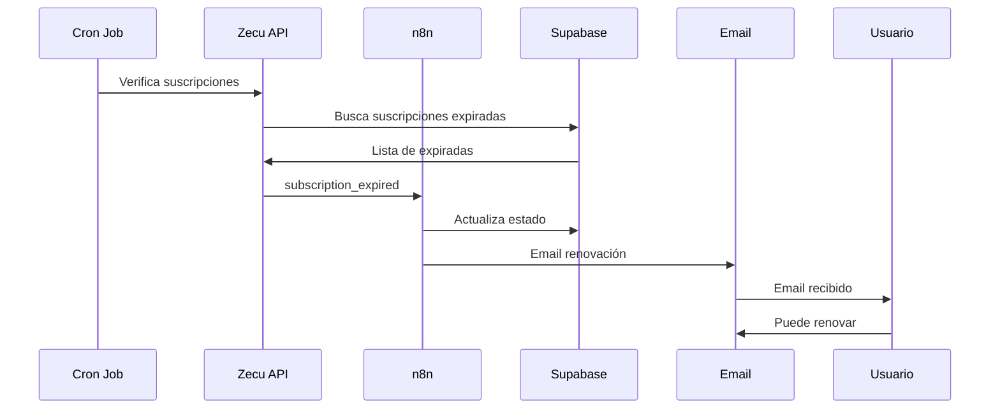
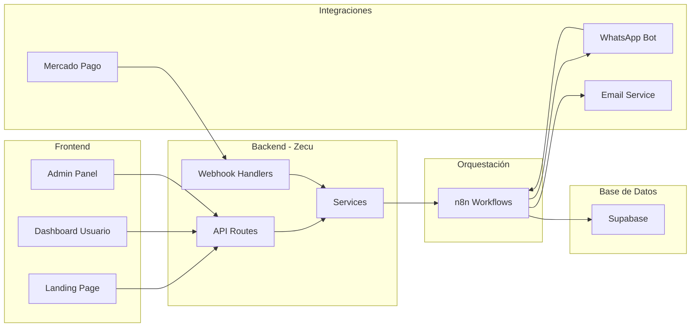
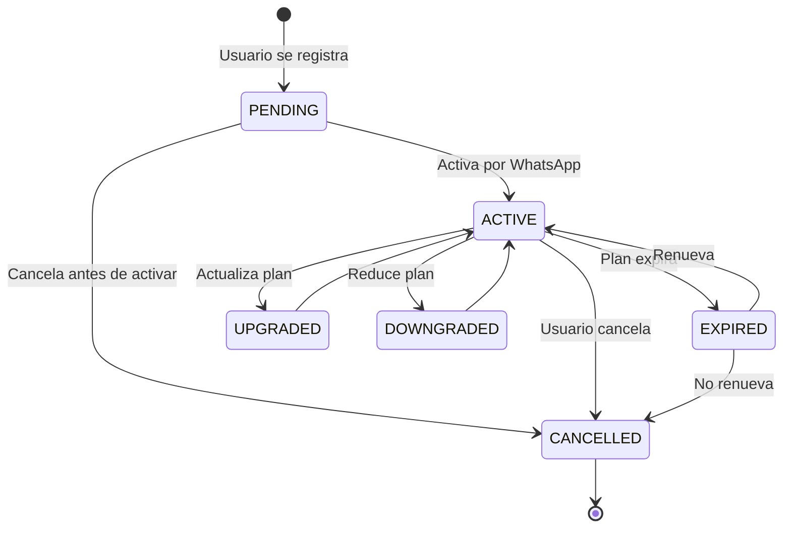

# Diagrama de Flujos de Usuario - Zecu

## 🎯 Flujos Completos del Sistema

Este documento contiene todos los flujos que puede atravesar un usuario en el sistema Zecu, incluyendo las integraciones con n8n y Supabase.

## 📊 Diagrama Principal de Flujos

```mermaid
graph TB
    %% Entrada de usuarios
    A[Usuario llega a Landing Page] --> B{¿Qué acción quiere?}
    
    %% Plan Gratuito
    B -->|Prueba Gratuita| C[Modal Onboarding]
    C --> D[Ingresa WhatsApp]
    D --> E[Valida Número]
    E --> F[Envía a API /subscriptions/free-plan]
    F --> G[Zecu crea suscripción PENDING]
    G --> H[Envía evento a n8n: subscription_created]
    H --> I[n8n: Crea registro en Supabase]
    I --> J[n8n: Envía mensaje WhatsApp]
    J --> K[Usuario recibe mensaje en WhatsApp]
    K --> L[Usuario responde en WhatsApp]
    L --> M[Bot WhatsApp procesa mensaje]
    M --> N[Bot envía a n8n: subscription_activated]
    N --> O[n8n: Actualiza Supabase a ACTIVE]
    O --> P[n8n: Envía confirmación WhatsApp]
    P --> Q[Usuario puede usar Zecu]
    
    %% Planes Pagos
    B -->|Plan Básico/Premium| R[Botón de Pago]
    R --> S[Redirige a Mercado Pago]
    S --> T[Usuario completa pago]
    T --> U[Mercado Pago webhook]
    U --> V[Zecu procesa webhook]
    V --> W[Envía evento a n8n: payment_approved]
    W --> X[n8n: Actualiza Supabase]
    X --> Y[n8n: Envía email confirmación]
    Y --> Z[Usuario puede usar Zecu]
    
    %% Gestión de Suscripciones
    Q --> AA[Dashboard Usuario]
    Z --> AA
    AA --> BB{¿Qué quiere hacer?}
    
    %% Upgrade
    BB -->|Upgrade| CC[Selecciona nuevo plan]
    CC --> DD[Procesa pago]
    DD --> EE[Envía evento: subscription_upgraded]
    EE --> FF[n8n: Actualiza Supabase]
    FF --> GG[n8n: Notifica cambio]
    
    %% Downgrade
    BB -->|Downgrade| HH[Selecciona plan inferior]
    HH --> II[Confirma cambio]
    II --> JJ[Envía evento: subscription_downgraded]
    JJ --> KK[n8n: Actualiza Supabase]
    KK --> LL[n8n: Notifica cambio]
    
    %% Cancelación
    BB -->|Cancelar| MM[Confirma cancelación]
    MM --> NN[Envía evento: subscription_cancelled]
    NN --> OO[n8n: Actualiza Supabase]
    OO --> PP[n8n: Envía email despedida]
    
    %% Expiración
    Q --> QQ[Plan expira]
    Z --> QQ
    QQ --> RR[Envía evento: subscription_expired]
    RR --> SS[n8n: Actualiza Supabase]
    SS --> TT[n8n: Envía email renovación]
    TT --> UU[Usuario puede renovar]
    UU --> R
    
    %% Uso del servicio
    Q --> VV[Envía mensaje a Bot]
    Z --> VV
    VV --> WW[Bot analiza mensaje]
    WW --> XX[Registra análisis en Supabase]
    XX --> YY[Envía resultado a usuario]
    YY --> ZZ{¿Límite alcanzado?}
    ZZ -->|No| VV
    ZZ -->|Sí| AAA[Notifica límite alcanzado]
    AAA --> BB
```

## 🔄 Flujos Detallados por Tipo

### 1. **Flujo de Registro - Plan Gratuito**

### 2. **Flujo de Pago - Planes Pagos**

### 3. **Flujo de Upgrade/Downgrade**

### 4. **Flujo de Cancelación**

### 5. **Flujo de Expiración**

## 🏗️ Arquitectura del Sistema

## 📋 Estados de Suscripción

## 🔄 Eventos del Sistema

### **Eventos de Suscripción**
- `subscription_created` - Nueva suscripción
- `subscription_activated` - Suscripción activada
- `subscription_expired` - Suscripción expirada
- `subscription_cancelled` - Suscripción cancelada
- `subscription_upgraded` - Plan actualizado
- `subscription_downgraded` - Plan reducido

### **Eventos de Pago**
- `payment_approved` - Pago aprobado
- `payment_rejected` - Pago rechazado
- `payment_pending` - Pago pendiente
- `payment_cancelled` - Pago cancelado

### **Eventos de Uso**
- `analysis_created` - Análisis realizado
- `limit_reached` - Límite alcanzado
- `feature_used` - Feature utilizada

## 🎯 Puntos de Integración con n8n

1. **Webhook de Suscripciones** (`/zecu-subscription`)
   - Recibe eventos de suscripción
   - Procesa cambios de estado
   - Actualiza Supabase
   - Envía notificaciones

2. **Webhook de Pagos** (`/zecu-mercadopago`)
   - Recibe webhooks de Mercado Pago
   - Procesa estados de pago
   - Actualiza suscripciones
   - Envía confirmaciones

3. **Webhook de WhatsApp** (`/zecu-whatsapp`)
   - Recibe mensajes del bot
   - Procesa comandos de usuario
   - Actualiza estados
   - Envía respuestas

## 📊 Métricas y Analytics

### **Métricas de Conversión**
- Registros → Activaciones
- Activaciones → Pagos
- Retención por plan
- Churn rate

### **Métricas de Uso**
- Análisis por usuario
- Features más usadas
- Tiempo de respuesta
- Satisfacción

## 🚨 Manejo de Errores

### **Errores Comunes**
- Número WhatsApp inválido
- Pago fallido
- Webhook timeout
- Supabase no disponible
- n8n no disponible

### **Estrategias de Recuperación**
- Reintentos automáticos
- Fallback a procesos locales
- Notificaciones de error
- Logging detallado

---

**Nota**: Este diagrama representa el estado actual del sistema. A medida que se implementen nuevas features, el diagrama se actualizará para reflejar los cambios.

