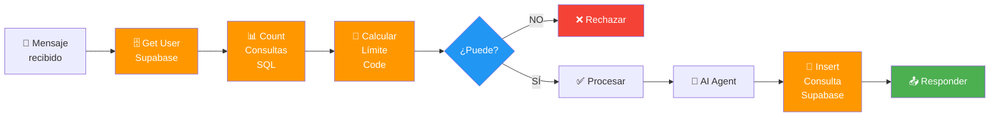
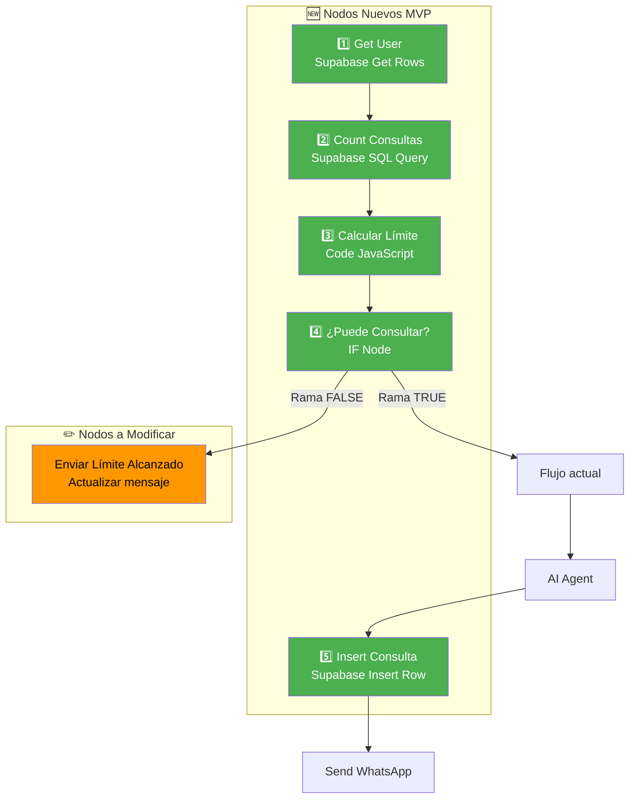
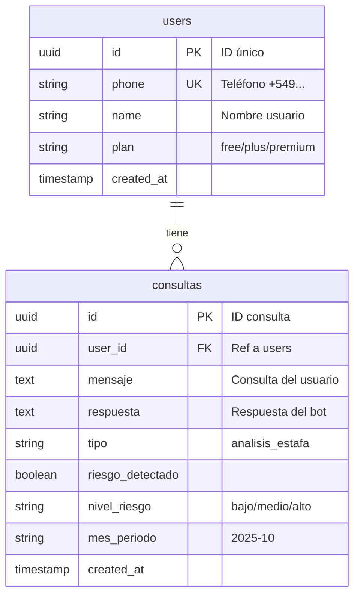
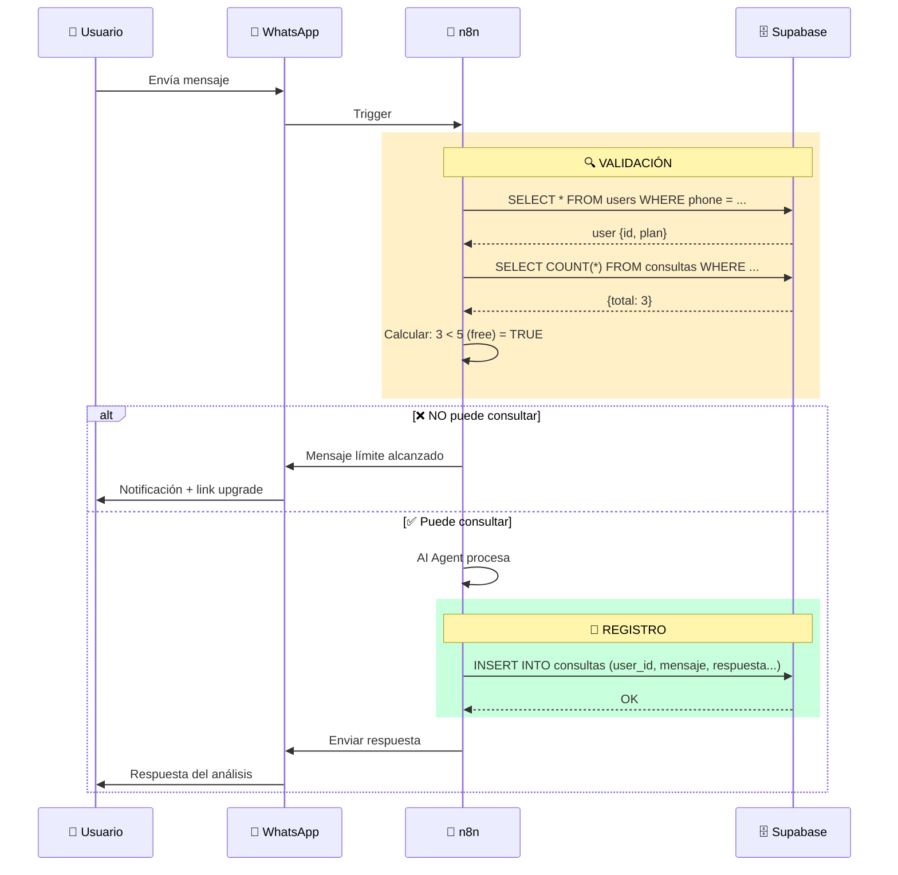

# 📊 Diagrama Visual MVP - Sistema Simple de Contabilización

## 🎯 Flujo Completo Simplificado

```mermaid
flowchart TD
    Start([👤 Usuario envía<br/>mensaje WhatsApp]) --> Twilio[📱 Twilio Trigger]
    
    Twilio --> CodeJS[⚙️ Code JavaScript<br/>Limpia 'whatsapp:']
    
    CodeJS --> Extract[🔍 data_extraction<br/>Extrae from, body]
    
    Extract --> GetUser[🗄️ Get User<br/>Supabase: SELECT * FROM users<br/>WHERE phone = ...]
    
    GetUser --> CountSQL[📊 Count Consultas<br/>Supabase SQL: SELECT COUNT(*)<br/>WHERE mes = actual]
    
    CountSQL --> CalcLimite[🧮 Calcular Límite<br/>Code: límites por plan<br/>free: 5, plus: 50]
    
    CalcLimite --> IfConsultar{🤔 ¿Puede<br/>Consultar?<br/>count < límite}
    
    IfConsultar -->|❌ NO| MsgLimite[📵 Twilio WhatsApp<br/>Mensaje: Límite alcanzado<br/>+ link a upgrade]
    
    MsgLimite --> EndNO([🔴 FIN])
    
    IfConsultar -->|✅ SÍ| PlanSwitch{🎯 Plan Switch<br/>free/plus/premium}
    
    PlanSwitch -->|FREE| ClassifierFree[🤖 Text Classifier<br/>saludo/consulta]
    
    ClassifierFree --> AIFree[🤖 AI Basic Response]
    
    AIFree --> InsertFree[💾 Insert Consulta<br/>Supabase]
    
    InsertFree --> SendFree[📤 Send WhatsApp]
    
    SendFree --> EndFree([🟢 FIN])
    
    PlanSwitch -->|PLUS/PREMIUM| MediaSwitch{📎 ¿Multimedia?}
    
    MediaSwitch -->|Texto| AIPlus[🤖 AI Agent<br/>Análisis completo]
    
    MediaSwitch -->|Imagen/Doc| ProcessMedia[🖼️ Process Media]
    
    ProcessMedia --> AIPlus
    
    AIPlus --> InsertPlus[💾 Insert Consulta<br/>Supabase: INSERT INTO consultas]
    
    InsertPlus --> SendPlus[📤 Send WhatsApp<br/>Respuesta final]
    
    SendPlus --> EndPlus([🟢 FIN])
    
    style Start fill:#4CAF50,stroke:#2E7D32,stroke-width:3px,color:#fff
    style GetUser fill:#FF9800,stroke:#E65100,stroke-width:2px,color:#fff
    style CountSQL fill:#FF9800,stroke:#E65100,stroke-width:2px,color:#fff
    style CalcLimite fill:#FF9800,stroke:#E65100,stroke-width:2px,color:#fff
    style IfConsultar fill:#2196F3,stroke:#1565C0,stroke-width:3px,color:#fff
    style InsertFree fill:#FF9800,stroke:#E65100,stroke-width:2px,color:#fff
    style InsertPlus fill:#FF9800,stroke:#E65100,stroke-width:2px,color:#fff
    style AIPlus fill:#9C27B0,stroke:#6A1B9A,stroke-width:2px,color:#fff
    style MsgLimite fill:#F44336,stroke:#C62828,stroke-width:2px,color:#fff
    style EndNO fill:#F44336,stroke:#C62828,stroke-width:2px,color:#fff
    style EndFree fill:#4CAF50,stroke:#2E7D32,stroke-width:2px,color:#fff
    style EndPlus fill:#4CAF50,stroke:#2E7D32,stroke-width:2px,color:#fff
```

---

## 🔍 Zoom: Solo la Parte de Contabilización



---

## 📦 Nodos Nuevos a Agregar



---

## 🗃️ Estructura de Datos



---

## 📊 Tabla de Decisión

| Plan | Consultas Usadas | Límite | ¿Puede? | Acción |
|------|-----------------|--------|---------|--------|
| FREE | 0-4 | 5 | ✅ SÍ | Procesar |
| FREE | 5+ | 5 | ❌ NO | Bloquear |
| PLUS | 0-49 | 50 | ✅ SÍ | Procesar |
| PLUS | 50+ | 50 | ❌ NO | Bloquear |
| PREMIUM | 0-99 | 100 | ✅ SÍ | Procesar |
| PREMIUM | 100+ | 100 | ❌ NO | Bloquear |

---

## 🔄 Secuencia de Operaciones



---

## 🎨 Leyenda de Colores

| Color | Elemento | Significado |
|-------|----------|-------------|
| 🟢 Verde | Inicio/Fin exitoso | Proceso completado |
| 🟠 Naranja | Operaciones Supabase | Acceso a BD |
| 🔵 Azul | Decisiones | Condicionales IF |
| 🟣 Morado | IA | Procesamiento inteligente |
| 🔴 Rojo | Errores/Bloqueos | Límite alcanzado |

---

## ✅ Ventajas Visuales del MVP

```
┌─────────────────────────────────────────────┐
│          ❌ ANTES (Complejo)                │
├─────────────────────────────────────────────┤
│  n8n → Next.js API → Supabase              │
│  n8n → Next.js API → Supabase              │
│  n8n → Next.js API → Supabase              │
│                                             │
│  😰 3 llamadas HTTP                         │
│  😰 3 archivos adicionales                  │
│  😰 Mayor latencia                          │
└─────────────────────────────────────────────┘

┌─────────────────────────────────────────────┐
│          ✅ AHORA (Simple MVP)              │
├─────────────────────────────────────────────┤
│  n8n → Supabase (directo)                  │
│                                             │
│  😊 Solo nodos nativos                      │
│  😊 Cero archivos extra                     │
│  😊 Menor latencia                          │
└─────────────────────────────────────────────┘
```

---

## 🚀 Tiempo de Implementación

```mermaid
gantt
    title Implementación MVP Simple
    dateFormat mm
    axisFormat %M min
    
    section Preparación
    Verificar tabla consultas     :done, prep1, 00, 2m
    Configurar credenciales       :done, prep2, 02, 3m
    
    section Nodos n8n
    Agregar Get User             :active, n1, 05, 3m
    Agregar Count Consultas      :n2, 08, 2m
    Agregar Calcular Límite      :n3, 10, 3m
    Agregar IF Puede Consultar   :n4, 13, 2m
    Agregar Insert Consulta      :n5, 15, 3m
    
    section Testing
    Prueba básica                :test1, 18, 3m
    Prueba límite                :test2, 21, 2m
    
    section Total
    ✅ LISTO                      :milestone, 23, 0m
```



**Total: ~23 minutos** ⏱️

---

## 📍 Ubicación de Nodos en el Workflow

```
FLUJO ACTUAL:
─────────────
Twilio Trigger
    ↓
Code JavaScript
    ↓
data_extraction
    ↓
    │
    │ 🆕 INSERTAR AQUÍ (antes de todo lo demás):
    │
    ├─→ Get User
    ├─→ Count Consultas  
    ├─→ Calcular Límite
    ├─→ ¿Puede Consultar?
    │       ├─ NO → Enviar Límite → FIN
    │       └─ SÍ ↓
    │
    ↓ (tu flujo actual continúa)
Plan Switch
Text Classifier
AI Agent
    │
    │ 🆕 INSERTAR AQUÍ (después de AI Agent):
    │
    └─→ Insert Consulta
    ↓
Send WhatsApp
```

---

**¿Listo para implementar? Sigue la guía MVP_SIMPLE_CONTABILIZACION.md** 🚀

